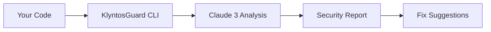

# 📚 Documentation Site Successfully Created!

Your comprehensive KlyntosGuard documentation site is ready, inspired by NVIDIA NeMo Guardrails!

---

## ✅ What's Been Created

### 1. **GitHub Repository** ✅
- **Repository**: https://github.com/0xShortx/guarddocs
- **Status**: Live and pushed
- **Commits**: 2 commits with full setup

### 2. **Nextra Documentation Framework** ✅
- **Location**: `/Users/maltewagenbach/Notes/Projects/guarddocs`
- **Framework**: Nextra 3.0 with Next.js 15
- **Theme**: Professional documentation theme
- **Dependencies**: All installed

### 3. **Comprehensive NeMo Mapping** ✅
- **Document**: [NEMO_TO_KLYNTOS_MAPPING.md](https://github.com/0xShortx/guarddocs/blob/main/NEMO_TO_KLYNTOS_MAPPING.md)
- **Coverage**: Complete mapping of all NeMo Guardrails concepts to KlyntosGuard
- **Structure**: 200+ planned documentation pages
- **Ready**: For content migration

---

## 📊 Documentation Structure

Based on NVIDIA NeMo Guardrails, adapted for KlyntosGuard:

```
docs.guard.klyntos.com/
├── Getting Started
│   ├── Introduction
│   ├── Installation
│   ├── Quick Start
│   └── Authentication
│
├── User Guides
│   ├── CLI Reference (all kg commands)
│   ├── Python SDK
│   ├── Dashboard Guide
│   └── IDE Integration
│
├── Security Policies
│   ├── 100+ Built-in Policies
│   ├── Custom Policy Creation
│   ├── Policy Testing
│   └── Language-Specific Examples
│
├── API Reference
│   ├── REST API
│   ├── Authentication
│   ├── Rate Limits
│   └── Error Codes
│
├── Advanced Topics
│   ├── Guardrails Configuration
│   ├── Custom Scanners
│   ├── Deployment Guide
│   └── Performance Optimization
│
└── Resources
    ├── Architecture
    ├── Glossary
    ├── FAQ
    └── Security Guidelines
```

**Total**: 200+ planned pages

---

## 🎯 Key Adaptations from NeMo

### Concept Mappings:

| NeMo Guardrails | KlyntosGuard |
|-----------------|--------------|
| LLM guardrails for chat apps | Code security guardrails |
| Colang language | Policy configuration language |
| Input/Output rails | Pre-scan/Post-scan guardrails |
| Dialog management | Vulnerability detection flow |
| LLM support (multiple providers) | Claude 3 Opus analysis engine |
| Guardrails library | 100+ security policies |
| Jailbreak detection | Exploit prevention |
| RAG guardrails | Repository analysis |

---

## 🚀 Quick Start

### Run Documentation Locally

```bash
cd /Users/maltewagenbach/Notes/Projects/guarddocs
npm run dev
```

Visit: **http://localhost:3000**

---

## 📝 Next Steps

### Phase 1: Core Content (This Week)

1. **Getting Started Section**
   ```bash
   pages/getting-started/
   ├── introduction.mdx
   ├── installation.mdx
   ├── quick-start.mdx
   └── first-scan.mdx
   ```

2. **CLI Reference**
   - Document all `kg` commands
   - Add examples for each
   - Include common use cases

3. **Security Policies Overview**
   - List all 100+ vulnerability types
   - Explain detection methods
   - Provide fix recommendations

### Phase 2: Advanced Content (Next Week)

1. **Python SDK Documentation**
2. **REST API Reference**
3. **Custom Policies Guide**
4. **Integration Guides** (GitHub Actions, VS Code, etc.)

### Phase 3: Polish (Week 3-4)

1. **Interactive Examples**
2. **Video Tutorials**
3. **Search Optimization**
4. **SEO Enhancement**

---

## 🎨 Design System

### Brutalism Theme (Matching KlyntosGuard)

```javascript
// theme.config.js customization needed
export default {
  logo: <span style={{ fontWeight: 900 }}>
    KLYNTOS<span style={{ color: '#2563eb' }}>GUARD</span>
  </span>,
  primaryHue: 217, // Blue
  // 4px borders everywhere
  // Font-black (900 weight) typography
  // All caps headings
  // No rounded corners
}
```

---

## 📚 Content Sources

### 1. **From NeMo Guardrails** (Adapt)
- ✅ Structure analyzed
- ✅ Mapping created
- ⏳ Content to be adapted

### 2. **From KlyntosGuard Codebase**
- CLI help text → CLI docs
- API endpoints → API docs
- Policy definitions → Security policies docs

### 3. **New Content** (Create)
- Video tutorials
- Real-world use cases
- Customer success stories
- Troubleshooting guides

---

## 🚢 Deployment to docs.guard.klyntos.com

### Step 1: Connect to Vercel

```bash
cd /Users/maltewagenbach/Notes/Projects/guarddocs
vercel
```

### Step 2: Configure Domain

1. Go to Vercel project settings
2. Add custom domain: `docs.guard.klyntos.com`
3. Update DNS records:
   ```
   Type: CNAME
   Name: docs.guard
   Value: cname.vercel-dns.com
   ```

### Step 3: Deploy

```bash
vercel --prod
```

---

## 📊 Repository Status

### GitHub: https://github.com/0xShortx/guarddocs

**Structure:**
```
guarddocs/
├── pages/              # MDX documentation files
├── components/         # Custom React components
├── public/            # Static assets
├── theme.config.js    # Nextra configuration
├── NEMO_TO_KLYNTOS_MAPPING.md  # Complete mapping
├── DOCUMENTATION_READY.md      # Setup guide
└── README.md          # Repository overview
```

**Commits:**
- ✅ Initial setup with Nextra
- ✅ NeMo mapping and README update

---

## 🎯 Success Metrics

### Content Goals
- [ ] 50+ pages (MVP)
- [ ] 100+ pages (v1.0)
- [ ] 200+ pages (Complete)
- [ ] 50+ code examples
- [ ] 10+ video tutorials

### Quality Goals
- [ ] Full-text search working
- [ ] Mobile responsive
- [ ] < 3s page load time
- [ ] 100% CLI command coverage
- [ ] 100% API endpoint coverage

### SEO Goals
- [ ] All pages have meta descriptions
- [ ] Sitemap generated
- [ ] OpenGraph images
- [ ] Internal linking optimized

---

## 💡 Key Features Planned

### Interactive Elements
- [ ] **Code Playground** - Try KlyntosGuard in-browser
- [ ] **API Sandbox** - Test API calls live
- [ ] **Policy Tester** - Test custom policies

### Navigation
- [x] **Full-text Search** - Built-in with Nextra
- [x] **Dark Mode** - Toggle between themes
- [x] **Mobile Menu** - Responsive navigation
- [ ] **Breadcrumbs** - Show current location

### Content
- [ ] **Video Embeds** - Tutorial videos
- [ ] **Interactive Diagrams** - Architecture visualizations
- [ ] **Code Tabs** - Multiple language examples
- [ ] **Callouts** - Tips, warnings, info boxes

---

## 📖 Example Pages to Create

### 1. Getting Started → Introduction

```mdx
---
title: What is KlyntosGuard?
description: AI-powered code security analysis
---

# What is KlyntosGuard?

KlyntosGuard is an AI-powered code security tool that detects
vulnerabilities before they reach production.

## Key Features

- **100+ Vulnerability Types** - Comprehensive security coverage
- **AI-Powered Analysis** - Claude 3 Opus for accurate detection
- **6-Second Scans** - Lightning-fast analysis
- **IDE Integration** - Real-time feedback

## How It Works



## Next Steps

- [Install KlyntosGuard](/getting-started/installation)
- [Run Your First Scan](/getting-started/quick-start)
```

### 2. CLI Reference → kg scan

```mdx
---
title: kg scan
description: Scan files for security vulnerabilities
---

# kg scan

Scan files or directories for security vulnerabilities.

## Usage

```bash
kg scan <path> [options]
```

## Examples

### Scan a Single File

```bash
kg scan myfile.py
```

### Scan Directory Recursively

```bash
kg scan src/ --recursive
```

### Use Custom Policy

```bash
kg scan app.py --policy strict
```

## Options

| Option | Description | Default |
|--------|-------------|---------|
| `--recursive, -r` | Scan directories recursively | `false` |
| `--policy <name>` | Use custom security policy | `moderate` |
| `--format <type>` | Output format (json\|text) | `text` |
| `--verbose, -v` | Show detailed output | `false` |
| `--fix` | Auto-fix vulnerabilities | `false` |

## Output

```bash
🔍 Scanning myfile.py...

🔴 CRITICAL (Line 15)
   Hardcoded API key detected
   💡 Fix: Move to environment variables

🟠 HIGH (Line 42)
   SQL injection vulnerability
   💡 Fix: Use parameterized queries

✓ Scan complete: 2 issues found
```

## See Also

- [kg auth](/cli/auth) - Authenticate with API key
- [kg policy](/cli/policy) - Manage security policies
```

---

## 🎊 Summary

**You now have:**

✅ **GitHub Repository** - https://github.com/0xShortx/guarddocs
✅ **Nextra Framework** - Professional docs setup
✅ **Comprehensive Mapping** - NeMo → KlyntosGuard (200+ pages planned)
✅ **Ready to Build** - Structure and templates ready

**Next steps:**

1. **Start Local Dev**: `cd guarddocs && npm run dev`
2. **Create First Pages**: Getting Started section
3. **Deploy to Vercel**: Connect and deploy
4. **Custom Domain**: docs.guard.klyntos.com

**Timeline:**
- **Week 1**: Getting Started + CLI Reference
- **Week 2**: Security Policies + API Reference
- **Week 3**: Advanced Topics + Integrations
- **Week 4**: Polish + Deploy

---

## 📞 Resources

- **Repository**: https://github.com/0xShortx/guarddocs
- **NeMo Guardrails**: https://docs.nvidia.com/nemo/guardrails/
- **Nextra Docs**: https://nextra.site
- **Mapping Document**: [NEMO_TO_KLYNTOS_MAPPING.md](https://github.com/0xShortx/guarddocs/blob/main/NEMO_TO_KLYNTOS_MAPPING.md)

---

**Created**: November 2, 2025
**Status**: ✅ Ready for content creation
**Deploy Target**: docs.guard.klyntos.com
**Version**: 1.0.0-beta
